

# Metody Programowania Równoległego - MPI

Autor: Kacper Kafara\
Grupa: wtorek 15:00

# Zadanie 1

Celem zadania był pomiar czasu i przyśpieszenia wykonania programu wypełniającego
strukturę danych liczbami losowymi w zależności od liczby liczb oraz konfiguracji OpenMP (klauzuli `schedule`).

Zdecydowałem się na skalowanie silne.

# Wyniki

Poniżej zamieszczam serię wykresów prezentujacych pozyskane wyniki.

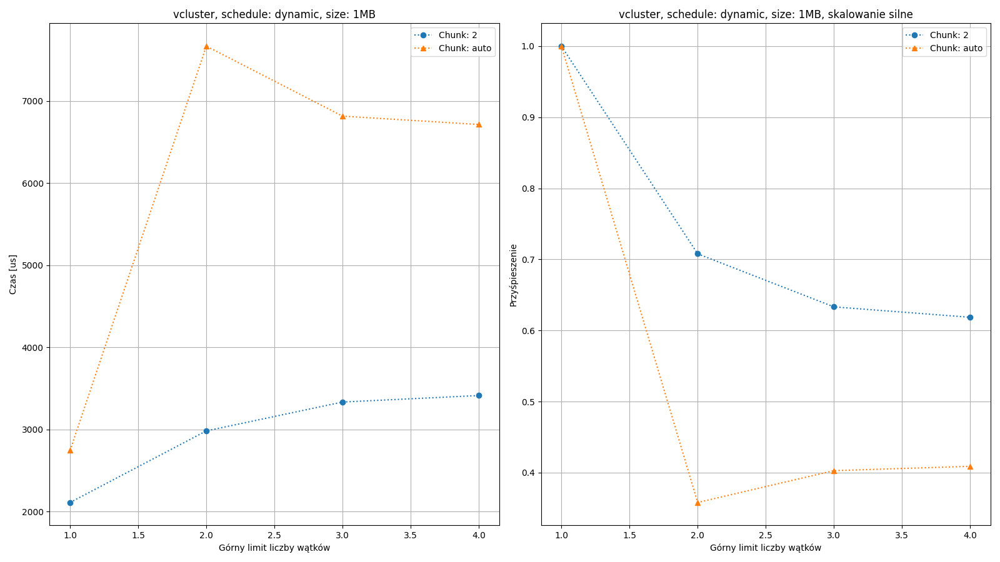

*Podpis*

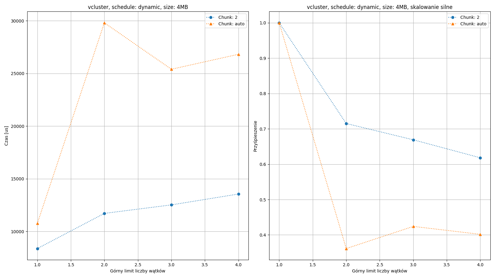

*Podpis*

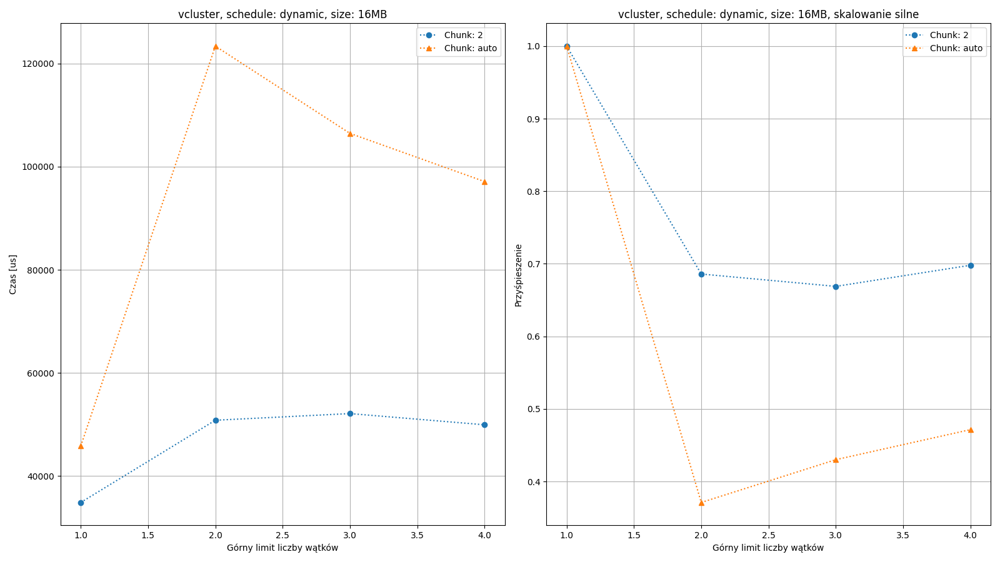

*Podpis*

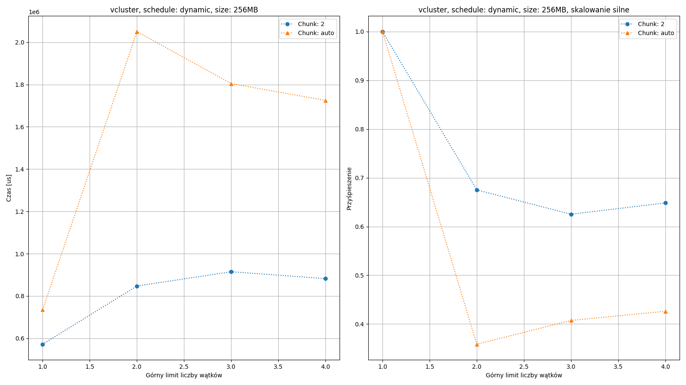

*Podpis*

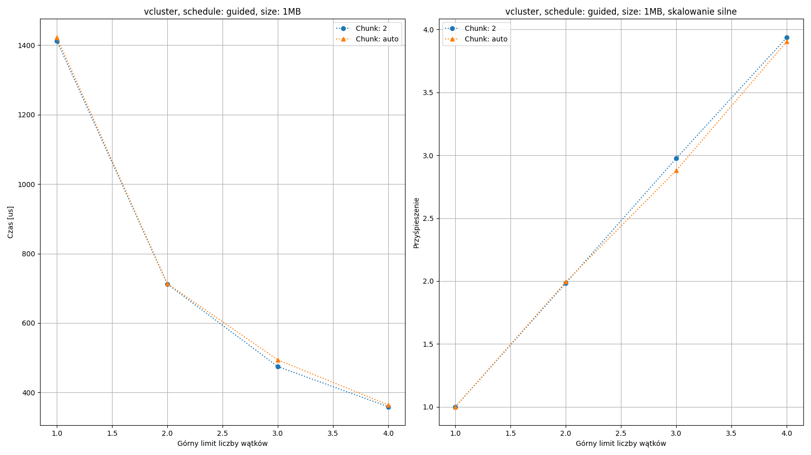

*Podpis*

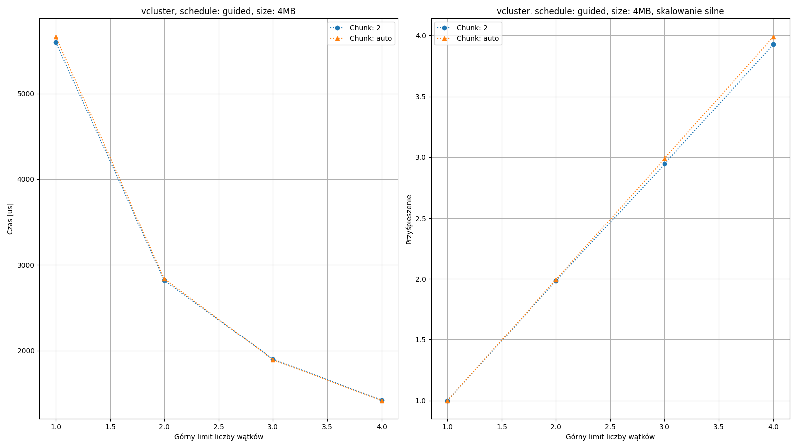

*Podpis*

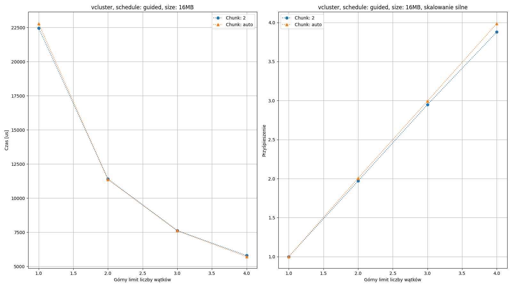

*Podpis*

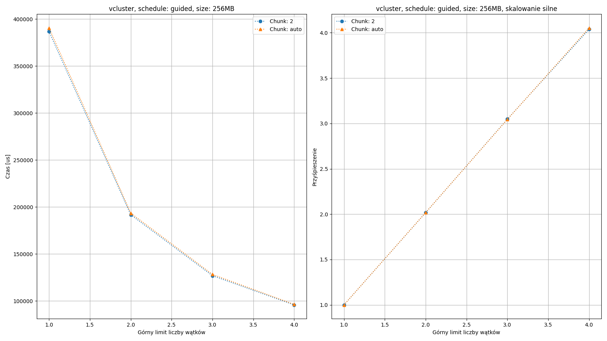

*Podpis*

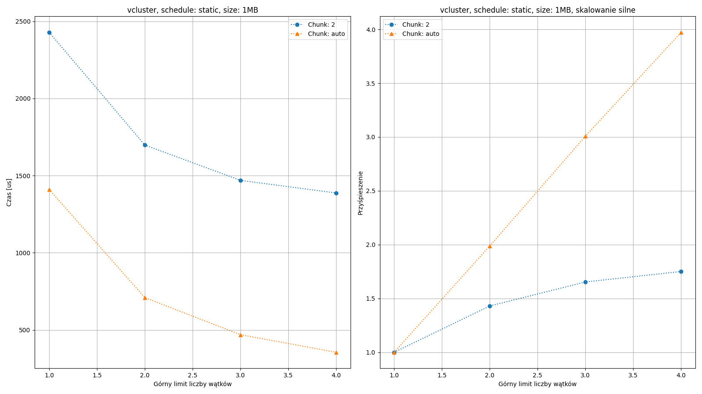

*Podpis*

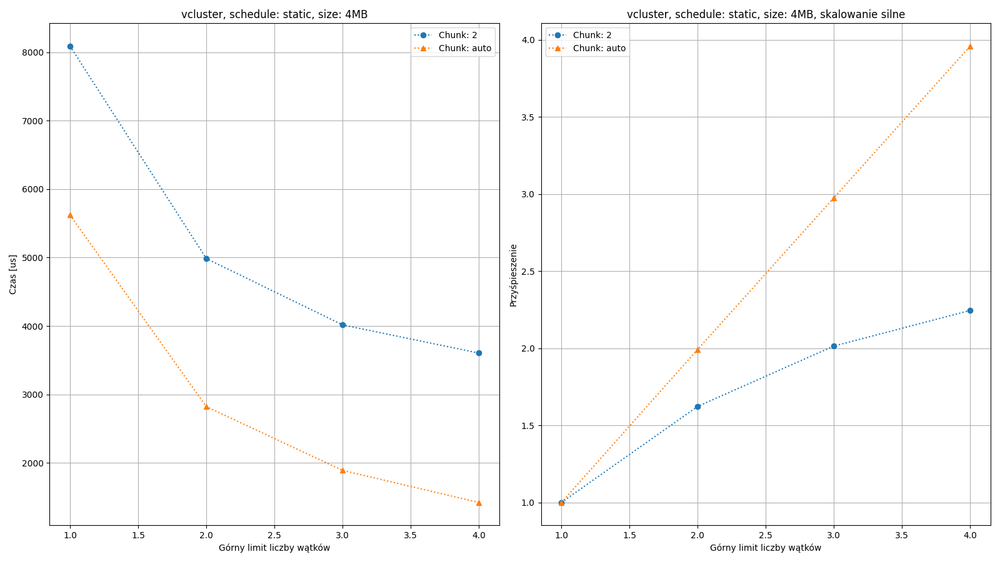

*Podpis*

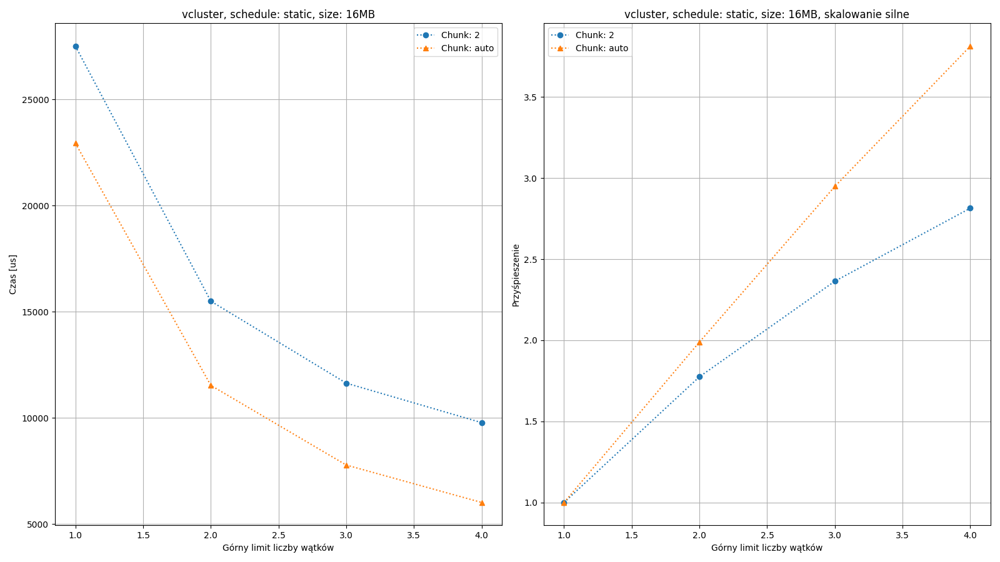

*Podpis*

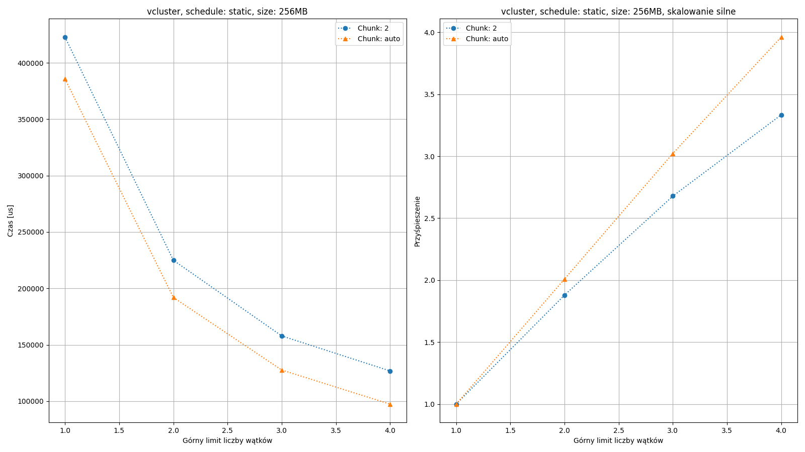

*Podpis*

# Wnioski

Dla eksperynemnut `dynamic` coś jest zrobione źle.

Wyniki nie są zgodne z oczekiwaniami. Oczekiwane charakterystyki to spadek $1/x$ dla czasu oraz
liniowy wzrost dla przyśpieszenia.

Najprawdopodobniejsza przyczyna to błąd w kodzie / konfiguracji. Nie jest to raczej wina vClustr'a
bo niezgodność jest zbyt duża.

Dla pozostałych eksperymentów wykresy są zgodne z oczekiwanymi charakterystykami.
Widzimy, że ustawienie parametru chunk "na sztywno" nie przynosi dobrych efektów.

`Guided` i `static` na `auto` osiągają podobne wyniki (najlepsze)

# Zadanie 2 - sortowanie kubełkowe (wersja 1)

Cele zadania:

1. Implemenetacja sekwencyjnego algorytmu sortowania kubełkowego
2. Przeprowadznienie pomiarów i znalezienie optymalnego rozmiaru kubełka (dającego najmniejszy czas wykonania, przy stałym rozmiarze zadania)
3. Implementacja algorytmu równoległego sortowania kubełkowego (wersja 1)
4. Przeprowadzanie pomiarów czasu i przyśpieszenia w zależności od liczby wątków (rozmiar tablicy i kubełka stały)

# Wybrane aspekty realizacji

## Implementowany algorytm

Implementowany był wariant 1:

* Wątki dzielą się wypełnianiem tablicy liczbami (każdy wypełnia swój fragment) (faza `draw`)
* Każdy z wątków czyta całą tablicę w celu przydzielenia liczb do odopowiednich kubełków (faza `scatter`)
* Każdy z wątków przydziela tylko te liczby, które powinny znaleźć się w przypisanym mu kubełku (faza `scatter`)
* Wątki dzielą się kubełkami do sortowania (każdy sortuje swoje) (faza `sort`)
* Wątki dzielą się kubełkami do przepisania do tablicy wyjściowej (każdy przepisuje swoje) (faza `gather`)

## Szczegóły implementacji

### Założenia

Zaimplementowany algorytm zakłada:

1. Liczba kubełków jest większa bądź równa liczbie wątków.
2. Liczba elementów w sortowanej tablicy jest więszka bądź równa liczbie wątków.

Brak powyższych założeń wprowadzałby niepotrzebne komplikacje do kodu, który musiałby w specjalny
sposób obsługiwać te przypadki.

### Struktury danych

* Poszczególne elementy są typu `double`.
* Sortowana tablica jest alokowana w ciągłym bloku pamięci na stercie (operator `new`).
* Kubełki reprezentowane są przez wektor wektorów `std::vector<std::vector<double>>` (więc przy implementacji `STL` wykorzystywanej przez `gcc`
	poszczególne kubełki zaalokowane są na stercie).

### Pomiar czasu

Do pomiarów czasu wykorzystana została funkcja `omp_get_wtime()` pochodząca z `OpenMP`.

Do czasu całkowitego został zaliczony cały region `parallel`, a więc wliczone zostały:

1. tworzenie środowiska wykonawczego przez `OpenMP`,
2. inicjalizacja stanu dla generatora liczb losowych,
3. fazy `draw`, `scatter`, `sort`, `gather`

Co istotne, do czasu wykonania nie został wliczony czas alokacji tablicy liczb ani czas alokacji wektora kubełków.
Uznałem, że w przypadku algorytmu równoległego, gdzie w eksperymentach rozmiar tablicy i liczba kubełków są stałe,
jest to część stała, nic nie wnosząca do badanej charakterystyki algorytmu równoległego. Oczywiście jest to istotna część
sekwencyjna algorytmu (alokacja kubełków), mająca duży wpływ na ostateczne wartości przyśpieszenia, jednak nie zalicza się ona do żadnej z badanych faz,
dlatego wykluczyłem ją z analizy.

## PRNG

Wykorzystano `erand48` (TODO: Puścić obliczenia dla jakiegoś mersene twister (albo znaleźć coś lepszego, bo ten jest kongruencyjny))

### Zrównoleglanie pętli `for`

Zgodnie z wynikami Zadania 1, do zrównoleglania pętli `for` wykorzystałem klauzulę `schedule(static)`, która dawała najlepsze rezultaty.

### Uniknięcie potrzeby synchronizacji

Zauważmy, że jeżeli przypisanie kubełków do wątków w fazie `scatter` nie jest jednakowe z podziałem wproadzanym przez `OpenMP` w fazie `sort`,
to może dojść do sytuacji, gdy do kubełka już sortowanego przez jeden wątek, inny będzie chciał dopisać wartość, bo skoro podziały nie są jednakowe
to zachodzą konflikty.

Jednym z możliwych rozwiązań tego problemu jest wprowadzenie synchronizacji (poprzez barierę) pomiędzy tymi fazami algorytmu.

Natomiast rozwiązaniem wybranym przeze mnie było przydzielenie kubełków do wątków w sposób jednakowy z `OpenMP` (`#pragma omp for schedule(static)`).

Specyfikacja wskzauje, że w przypadku braku jawnego przekazania wartości `chunk` praca dzielona jest spójnymi przedziałami możliwie po równo pomiędzy wątki.
Jednak w przypadku, gdy liczba wątków nie dzieli liczby kubełków dokumentacja nie specyfikuje jak rozdzielone będą kubełki "będące resztą z dzielenia".

Inspekcja implementacji wersji `OpenMP` dostarczanej wraz z `gcc 10.3.0` wykazała, że praca dzielona jest wg rosnących indeksów po równo wątkom w kolejności ich `id` (zdaje się, że to określa jeszcze specyfikacja).
Do tego jeżeli mamy $r$ kubełków będących "resztą z dzielenia", to zakresy zadań dla pierwszych $r$ wątków będą powiększone o $1$.

Jeżeli mamy $n_w$ wątków i $r$ to reszta z dzielenia liczby kubełków $n_k$ przez $n_w$, to kubełki przypisane wątkowi $w$ możemy opisać następująco:

* $r \le w \implies \{ w * floor(\frac{n_k}{n_w}) + r, \ldots, (w + 1) * floor(\frac{n_k}{n_w}) + r - 1 \}$

* $r > w \implies \{ w * floor(\frac{n_k}{n_w}) + w, \ldots, (w + 1) * floor(\frac{n_k}{n_w}) + w \}$

### Usprawnienie fazy `gather`

Zastosowałem prostą optymalizację korzystającą z faktu, że wątek zliczając rozmiary kubełków należących do wątków o niższym `id`, nie potrzebuje
iterować przez wszystkie te kubełki dla każdego analizowanego przez siebie kubełka. Wystarczy, że zrobi to raz, dla pierwszego przepisywanego
przez siebie kubełka i zapamięta wartość.

# Wyniki

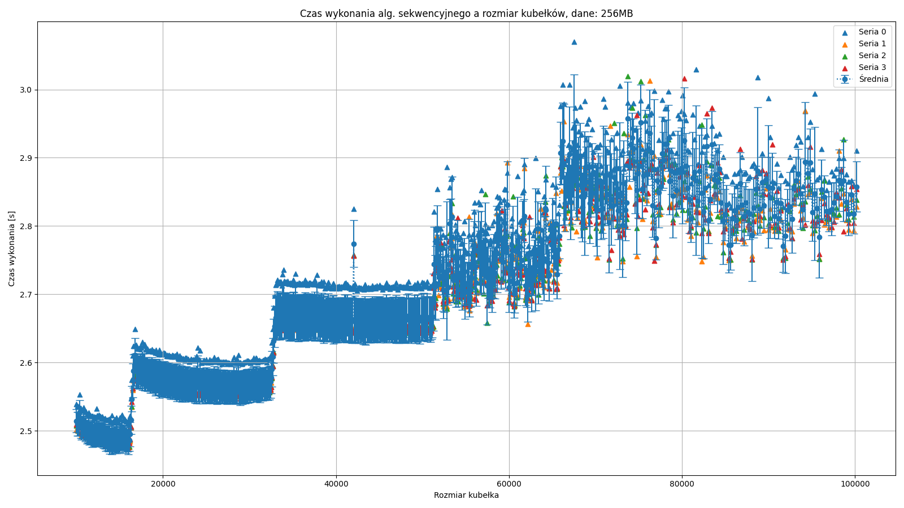
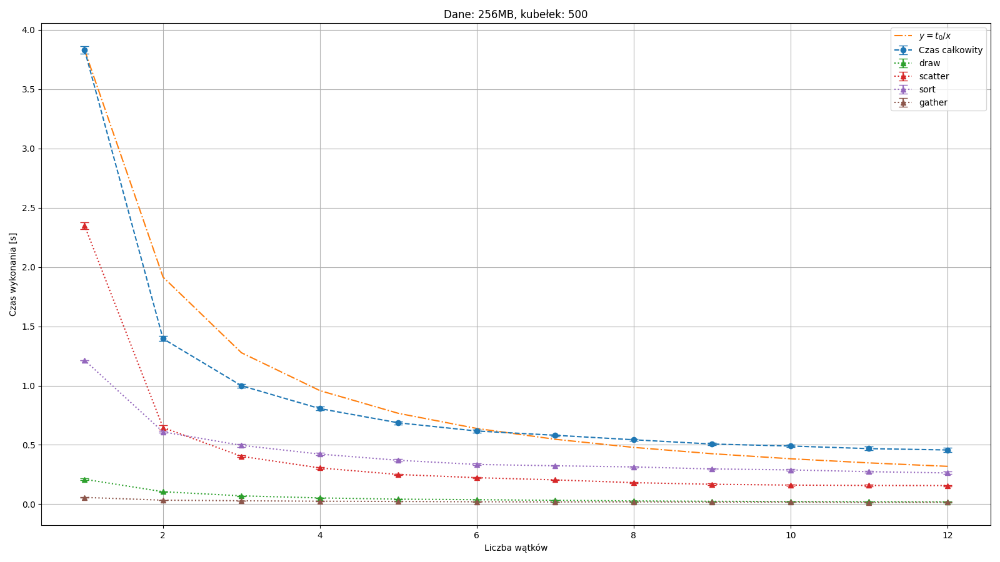
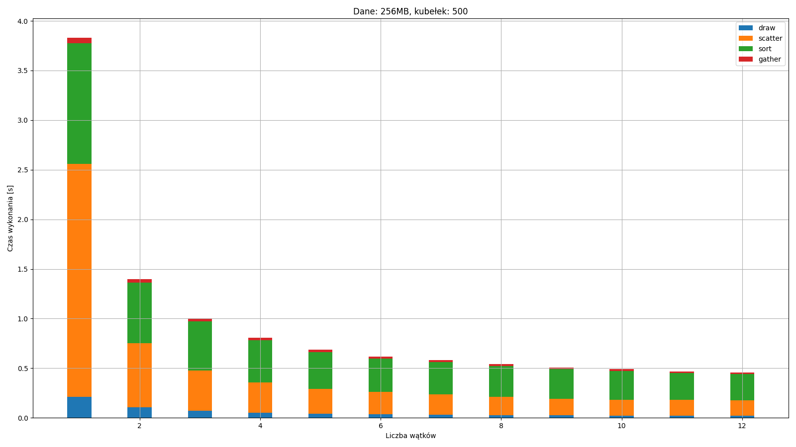
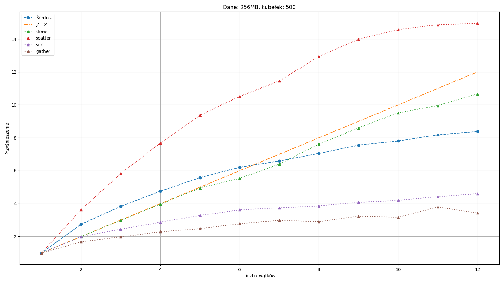

# Kod źródłowy

W załączniku...
